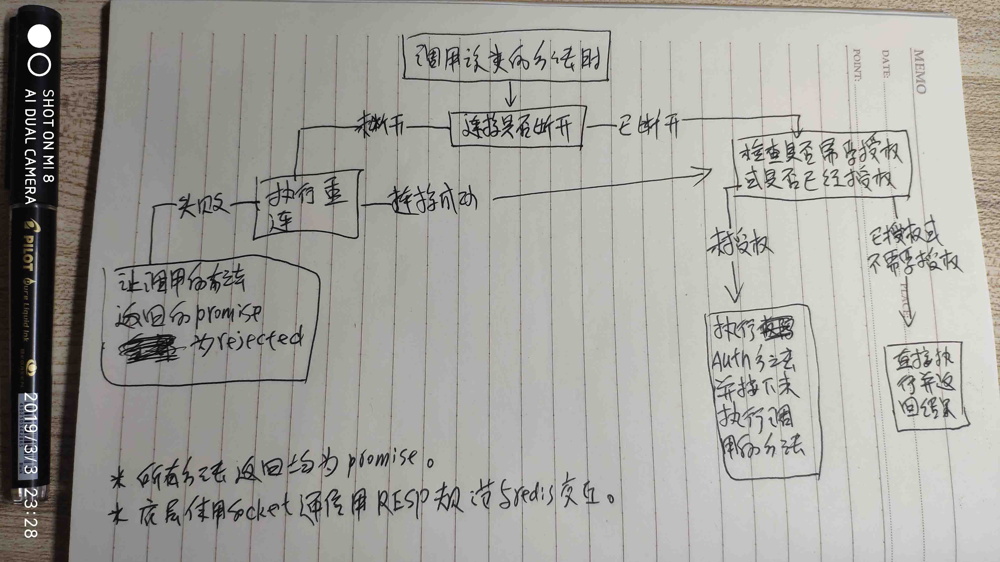
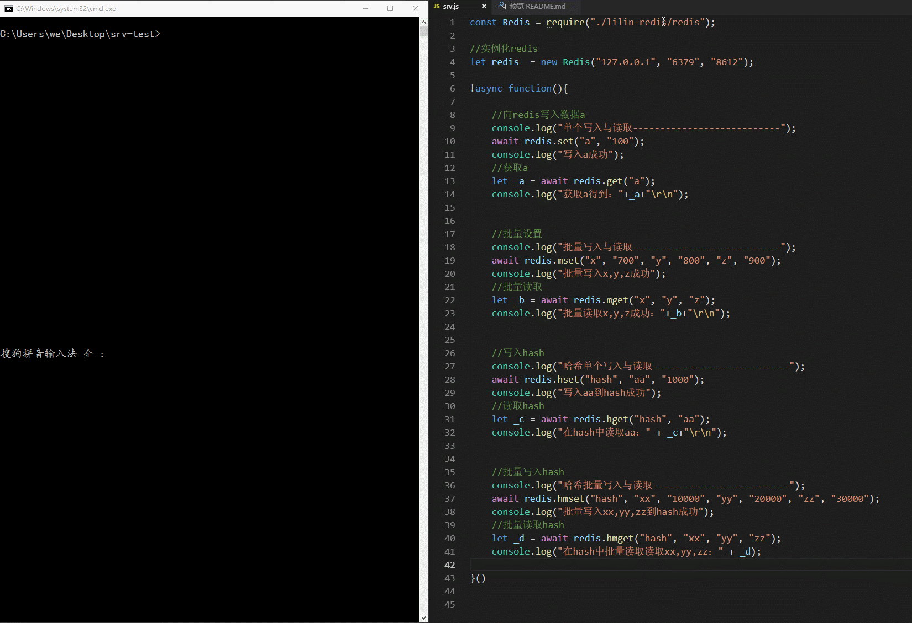

# 简单的redis模块

## api

*api均返回promise*

|api|参数|作用|resolved数据|备注|
|-|-|-|-|-|
|auth|pass|校验授权(需要密码是才用，否则报错)|null|不建议使用，因实例化该类时如果传递pass参数，会自动校验|
|set|key, val|设置键值|null|-|
|get|key|获取指定键的值|val|-|
|expire|key,time|设置key多少时间后过期|1\|0|time参数为Number类型，以秒来计算|
|mset|key1,val1,key2,val2,...|批量设置键|null|-|
|mget|key1, key2, ...|批量获取key|[val1, val2, ...]|-|
|hset|hash, field, val|设置hash字段|null|-|
|hget|hash, field|获取hash键的值|val|-|
|hmset|hash, field1, val1, ...|批量设置hash字段|null|-|
|hmget|hash, field1,...|批量获取hash字段|[val1,val2,...]|-|
|lpush|list, val1,...|向列表头压入数据|null|-|
|rpush|list, val1,...|向列表压入数据|null|-|
|lpop|list|移除并获得列表头第一个元素|val|-|
|rpop|list|移除并获得列表最后一个元素|val|-|
|lrange|list, start, end|获取列表指定索引范围的数据|[val1,val2,...]|如果省略第2、3位参数，则默认返回列表全部元素|

*api在继续完善中。。。*

```javascript
//简单示例
const Redis = require("./redis");

let redis = new Redis("127.0.0.1", "port", "pass");//三个参数都为可选，pass参数不传按不检验授权处理

//只管调用方法就行，不用管理如node-redis里的ready事件，在这里都是内部自己维护与实现
redis.get("key")
.then(data=>{
    console.log(data);
})
.catch(err=>{
    console.log(err);
});
```

## 大概逻辑
*懒得写，上草图*




## 简单测试

*如图：*



---
## 相关参考资料
  * [RESP协议文档](https://redis.io/topics/protocol)